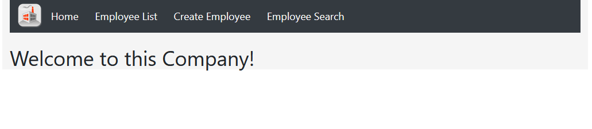
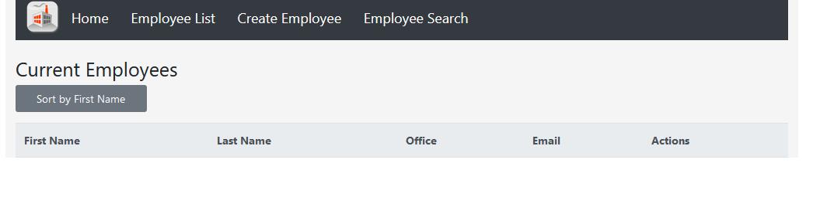
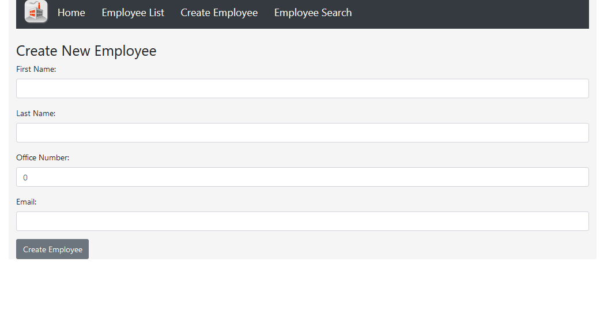
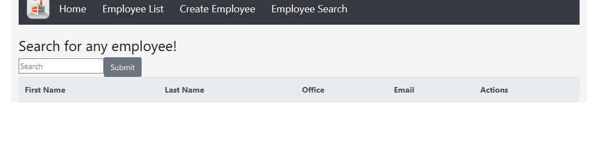

#  Employee Directory
## Description
This is the first prototype for a typical employee directory. Built from scratch using react, bootstrap, and mongodb. This application was submitted as homework to the UCSD coding bootcamp program.
  
## Table of Contents
-[Instalation](#instalation)

-[Usage](#usage)

-[Liscense](#liscense)

-[Contributions](#contributions)

## Instalation 
You will have to run npm install in both the root directory and the client directory for the application to work. You will also have to create your own either local or remote mongo server for the application to use.

Concurrently was giving me some issue that I didn't feel like fixing at the time so for the time being 'npm start' does not work. Instead you will have to have two command lines open. One will have to be open in the root directory where you will run
`node server.js`

The other will be open in the client directory where you can run
`npm start`

## Usage 
The front page looks like this

You can see all employees on the employee list page. The only sorting button availible at this time is the sort by first name button.

You can create an employee on this page. Creating an employee will take you back to the home page and give you an alert.

You can search for any employee on this page. All fields will be searched and and hits in any field will be returned after submitting. It is case sensitive.

You can use the links on the navbar at anytime to navigate the site.

## License 
MIT

## Contributions
 No contributors
